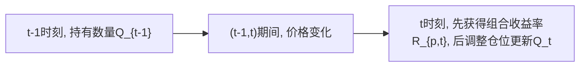
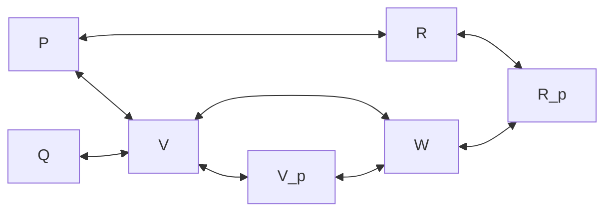

# risk-return-data-and-py
This repository offers notes on a basic Python-based backtesting framework for trading strategies, covering fundamental aspects such as choosing between percentage and log returns, annualized Sharpe ratio calculations, and transaction fee management. Currently a work in progress.

# 风险收益数据与Python处理

笔者在本科期间, 由于研究需要, 基于Python语言自行搭建了一套交易策略的回测框架, 其间遇到诸多困难, 如百分比收益率和Log收益率的取舍, 夏普比率的不同年化方式计算和手续费的计算等. 笔者本科没有修读金融时间序列分析的课程, 结合开源社区的帖子与自己的理解尝试完成了若干代码. 近日得闲, 希望将经验教训梳理为文档, 供后续借鉴/批判. 

注: 

1. 本文的大部分数据(如价格$(P)$, 收益率$(R)$和权重$(W)$)都是向量, 因此默认公式中的向量不做加粗处理. 在讨论面板数据(多个资产的多期数据)的时候, 会明确说明是否为向量, 是否加粗. 
2. 时间序列和向量仅在定义的时候做区分, 使用起来不做详细区分. 
3. 如果某个向量有两个下标如($P_{3,t=5}$), 则其第一个下标为该资产在资产组合中的编号, 第二个下标表示时间. 如果某个向量仅有一个下标如$(P_5)$, 则其上下文必有详细说明. 
4. 资产的编号统一为$[1, 2, \cdots, N]$, 累加累乘时用$(i)$来遍历, 下标为$(_p)$时表示其是资产组合的变量; 时间的编号统一为$[1, 2, \cdots, T]$, 累加累乘时用$(t)$来遍历. 
4. 格式方面, 全文采用英文标点; 在适应知乎编辑器的Markdown导入版本, 行内公式用两个美元符号包裹(\$\$ math $$). 
4. 联系我: notblacknotcrow@qq.com

# 1. 收益率

先讨论不涉及时间长度的, 假设所有时间间隔都一样, 并且收益率只是两个间隔之间的收益率. 后面再讲EAR, APR之类

## 1.1 百分比收益率

我们讨论特定案例时候, 时间$(t)$应该是固定的. 金融领域常见的有日频, 年频等.  

假设资产价格的时间序列为$[P_t]$, $P_t$表示资产在$t$时刻的价格. 
$$
[P_t]: P_0,\quad P_1,\quad P_2,\quad ...,\quad P_T, \quad t \isin [0,T]
$$
$$R_t$$表示资产在$$t$$时刻的收益率. 其定义为: 
$$
R_t = \frac{P_t - P_{t-1}}{P_{t-1}} = \frac{P_t}{P_{t-1}}-1
$$
由此可得到收益率的时间序列$[R_t]$: 
$$
[R_t]: R_1,\quad R_2,\quad ...,\quad R_T, \quad t \isin [1,T]
$$
可以注意到收益率的时间序列总是比价格的短一个单位. 为此我们刻意将价格的时间序列从0开始编号. 

另外, [有些文档](https://www.math.pku.edu.cn/teachers/lidf/course/fts/ftsnotes/html/_ftsnotes/fts-intro.html#intro-return)会将$R_t + 1 = \frac{P_t}{P_{t-1}}$称为毛收益率, 将我们原先定义的$(R_t)$称为净收益率. 本文档不专门讨论毛收益率的概念, 所有的文字"收益率"均指净收益率$(R_t)$. 

有时候, 我们希望的得到一段长度为$$k$$的时期$[t-k,t]$的累计收益率(Cumulative Return, $CR$). 
$$
\begin{align*}
P_t &= (R_t + 1) \cdot P_{t-1} \\
&= (R_t + 1)(R_{t-1}+1) \cdot P_{t-2} \\
&= (R_t + 1)(R_{t-1}+1) \cdots (R_{t-k}+1) \cdot P_{t-k-1} \\
1 + CR[t-k,t] = \frac{P_t}{P_{t-k-1}} &= (R_t + 1)(R_{t-1}+1) \cdots (R_{t-k}+1) \\
CR[t-k,t] = \frac{P_t}{P_{t-k-1}}-1 &= (R_t + 1)(R_{t-1}+1) \cdots (R_{t-k}+1)-1 \\
CR[t-k,t] &= \left(\prod_{i=0}^k (R_{t-i} + 1)\right) - 1
\end{align*}
$$
特别地, 当$k=t-1$时, 有$CR[1,t] = \frac{P_t}{P_0} = (R_t + 1)(R_{t-1}+1) \cdot ... \cdot (R_1+1)$, 为$[1,t]$期间的累计收益率. 

## 1.2 对数收益率

### 1.2.1 对数收益率的定义

对数收益率的由来和后文的连续复利收益率有关, 且有对数正态分布等方面的作用, 本节先按下不表, 将对数收益率作为和百分比收益率相区分的概念. 

延续1.1节设定的资产价格的时间序列为$[P_t]$, 有对数收益率$r_t$: 
$$
r_t = ln(\frac{P_t}{P_{t-1}}) = ln(1+R_t)
$$

据此定义对数累计收益率的序列$[CLogR]$, 对于其每一项, 有: 
$$
\begin{align*}
CLogR[t-k,t] &= r_{t-k} + r_{t-k+1} + \cdots + r_{t} \\
&= \sum_{i=t-k}^{t} r_i
\end{align*}
$$

这种累计收益率的计算性质被称为"时序可加性", 是由对数函数$(ln)$的性质而来的, 很容易结合图像理解. 

### 1.2.2 对数收益率和百分比收益率的区别

对数收益率, 虽然和百分比收益率有直接的数学联系, 但不能直接比较. 我们在实际应用中, 如比较不同资产的风险收益表现时, 不能跨越收益率的计算方法比较其间优劣. 

**a. 对数收益率相较百分比收益率会低估增长, 高估衰退**

观察$R_t = \frac{P_t}{P_{t-1}}-1$和$r_t = ln(\frac{P_t}{P_{t-1}})$, 设$x=P_t/P_{t-1}$, 有:
$$
\begin{align*}
R_t &= x - 1 \\
r_t &= ln(x)
\end{align*}
$$
注意到函数$y=x-1$除了在切点$(1,0)$以外, 都在函数$y=ln(x)$的上方, 因此有:
$$
\begin{align*}
R_t &> r_t, \quad P_t \neq P_{t-1} \\
R_t &= r_t = 0, \quad P_t = P_{t-1}
\end{align*}
$$

**b. 对数收益率的累计收益率相较百分比收益率的累计收益率更小**

显然, 对数收益率的累计收益率, 相较百分比收益率的累计收益率, 存在差异: 
$$
\begin{align*}
CLogR[t-k,t] &= r_{t-k} + r_{t-k+1} + \cdots + r_{t} \\
&= ln(1+R_{t-k}) + ln(1+R_{t-k+1}) + \cdots + ln(1+R_{t}) \\
&= ln((1+R_{t-k})(1+R_{t-k+1}) \cdots (1+R_{t})) \\
&= ln(CR[t-k,t]) \\
CLogR[t-k,t] &< CR[t-k,t]
\end{align*}
$$

考虑$y=x$和$y=ln(x)$的图像, 可知对数累计收益率总是比百分比收益率的累计收益率小. 另外需要注意的是, 对数收益率的累计收益率就是百分比收益率的累计收益率取对数这个性质, 在做论文, 研报复现的时候可以用来帮助比较策略.  设想一个二十年期的日频策略, 百分比累计收益率有600%, 对数累计收益率只有160%, 两种方法计算的累计净值曲线也大不相同, 在读者没注意到的时候存在误导性.   

## 1.3 资产组合的收益率

### 1.3.1 特定截面下资产组合收益率计算

将多个资产以一定的的权重组合起来, 就构成了一个资产组合.  

当我们需要记录每一个资产的名称时, 可以以字典的形式定义一个含有$N$个资产的资产组合$(Portfolio)$:
$$
\begin{align*}
\text{Portfolio} &= \left\{ \begin{array}{ll}
    \text{asset}_1 &: W_1, \\
    \text{asset}_2 &: W_2, \\
    &\vdots \\
    \text{asset}_n &: W_N
\end{array} \right\} \\
\text{s.t.} \quad &\sum_{i=1}^N W_i = 1
\end{align*}
$$
其中, $(asset_i)$代表一个特定的资产, $(w_i)$代表其分配的权重. 如果事先约定过资产$(asset)$的顺序, 也可以直接用权重向量$(W)$来表示一个资产组合: 
$$
W = [W_1, W_2, W_3, \cdots, W_N]
$$
资产组合的价格数据$(\mathbf{P})$和收益率数据$(\mathbf{R})$也可以依照事先约定的资产顺序从字典简化到向量. 

设想一个有$(N)$个资产的资产组合, 我们关注它从时间$(t-1)$到时间$(t)$之间的收益率, 有:
$$
R_{p,t} = \sum^N_{i=1} W_{i,t} \cdot R_{i,t}
$$
也即整个组合的收益率$(R_p)$是所有资产的收益率$(R_i)$关于权重$(w_i)$的加权平均. 

### 1.3.2 总量, 权重与截面可加性

常见的投资学或金融时间序列教材可能会止步于投资组合整体收益率的计算, 而不展开"权重"这一概念. 金融学中通用的"权重"概念, 可以理解为收益率的权重, 但其首先是总量(Volume, $V$)的权重. 

让我们定义资产组合$(Portfolio)$含有的$(N)$个资产中的第$(i)$个资产在$(t)$时刻的总量为$(V_{i,t})$, 并有:
$$
\begin{align*}
V_{i,t} &= P_{i,t} \cdot Q_{i,t} \\
V_{p,t} &= \sum^N_{i=1} V_{i,t}
\end{align*}
$$
由此给出其权重的定义$(w_{i,t})$:
$$
W_{i,t} = \frac{V_{i,t-1}}{V_{p,t-1}}
$$
其中$(V_{p,t-1})$是整个组合在$(t-1)$时刻的总量. 

不难发现1.3.1小节中限制条件$(\sum^N_{i=1} W_{i,t} =1)$的由来: 
$$
\sum^N_{i=1} W_{i,t} = \frac{\sum^N_{i=1} V_{i,t-1}}{V_{p,t-1}} = 1
$$

基于以上定义, 资产的百分比收益率具有1.3.1小节提到的计算组合收益率$(R_p)$的方法是可行的, 它被称为百分比收益率的"截面可加性". 

在证明截面可加性之前, 让我们先讨论组合收益率$(R_p)$应该如何理解. 组合收益率反映了组合在某个期间的收益, 那么它不应该像单个资产的收益率一样定义在价格上, 而应该定义在总量上: 
$$
R_p^? = \frac{V_{p,t} - V_{p,t-1}}{V_{p,t-1}}
$$
 这个式子看起来很合理, 但果真如此吗? 我们将其展开就会发现: 
$$
R_p^? = \frac{P_{p,t} \cdot Q_{p,t} - P_{p,t-1} \cdot Q_{p,t-1}}{V_{p,t-1}}
$$
显然, 分子中的$V_{p,t}$带来了$(t)$时刻调整过后的数量$(Q_t)$, 因此$(R_p^?)$无法反映我们在$(t-1)$时刻持有组合至$(t)$时刻的收益率. 

我们给出真正的组合收益率$(R_p)$的定义:
$$
R_p = \frac{P_{p,t} \cdot Q_{p,t-1} - P_{p,t-1} \cdot Q_{p,t-1}}{V_{p,t-1}}
$$
由此定义, 截面可加性的证明并不困难, 注意到: 
$$
\begin{align*}
\sum^N_{i=1} W_{i,t} \cdot R_{i,t} &= \sum^N_{i=1} \frac{V_{i,t-1} \cdot R_{i,t}}{V_{p,t-1}} \\
&= \sum^N_{i=1} \frac{ Q_{i,t-1} \cdot P_{i,t-1} \cdot R_{p,t}}{V_{p,t-1}} \\
&= \sum^N_{i=1} \frac{ Q_{i,t-1} \cdot P_{i,t-1} \cdot (1 + R_{p,t}) - Q_{i,t-1} \cdot P_{i,t-1}}{V_{p,t-1}} \\ 
&= \sum^N_{i=1} \frac{ Q_{i,t-1} \cdot P_{i,t} - Q_{i,t-1} \cdot P_{i,t-1}}{V_{p,t-1}} \\ 
&= R_{p,t}
\end{align*}
$$

### 1.3.3 小结: 组合的权重, 面值和收益率

#### a. 组合的变量梳理

在本文1.1小节, 我们在个体的时间序列上定义了价格和收益率. 

在1.2小节, 我们在截面上定义了权重, 但没给出时间序列的定义. 让我们结合已经定义的价格和收益率数据讲解这个问题. 

对于某组合内的特定资产, 组合对其有权重: 
$$
[W_t]: W_0,\quad W_1,\quad W_2,\quad ...,\quad W_T, \quad t \isin [0,T]
$$
接下来让我们梳理目前为止定义的变量. 
$$
\begin{align*}
&[P_t]: P_0,\quad P_1,\quad P_2,\quad ...,\quad P_T, \quad t \isin [0,T] \\
&[Q_t]: Q_0,\quad Q_1,\quad Q_2,\quad ...,\quad Q_T, \quad t \isin [0,T] \\
&R_t = \frac{P_t - P_{t-1}}{P_{t-1}} = \frac{P_t}{P_{t-1}}-1 \\
&V_{i,t} = P_{i,t} \cdot Q_{i,t} \\
&V_{p,t} = \sum^N_{i=1} V_{i,t} \\
&W_{i,t} = \frac{V_{i,t-1}}{V_{p,t-1}}
\end{align*}
$$

可以看出, 我们的价格$(P)$和数量$(Q)$是外生给定的, 而其余的变量从中衍生出来. 这种定义只是为了方便理解, 不要被其限制思路. 在实际应用中, 既可以调整数量$(Q)$以实现特定的权重$(W)$, 也可以通过预测收益率$(R)$来预测价格$(P)$.  

注: 理想情况下, 下图所有箭头都应该是双箭头. 

#### b. 期间, 期末

这张表格可以帮助理解在不同的期间, 期末中各个变量的情况. 除$(R_0)$为无意义以外, 其余的横线$(-)$均表示该变量在该时间处于变化之中. 

$$
\begin{array}{|c|c|c|c|c|c|c|c|c|}
    \hline
               & t=0 & t\isin{(0,1)} & t=1 & t\isin{(1,2)} & t=2 & \cdots & t\isin{(T-1,T)} & t=T \\ \hline
    \text{P}   & P_0 & -          & P_1 & -           & P_2 & \cdots & -            & P_T \\ \hline
    \text{W}   & W_0 & - & W_1 & - & W_2 & \cdots & - & W_T \\ \hline
    \text{R}   & -   & -        & R_1   & -         & R_2   & \cdots & -      & R_{T}    \\ \hline
    \text{Q}   & Q_0 & Q_0          & Q_1 & Q_1           & Q_2 & \cdots & Q_{T-1}            & Q_T \\ \hline
    \text{V}   & V_0 & -          & V_1 & -           & V_2 & \cdots & -            & V_T \\ \hline
\end{array}
$$

### 1.3.4 流量, 换手率和交易成本

定义$(\Delta V_{i,t} = V_{i,t} - V_{i,t-1}, t\isin[1,T])$为单个证券的交易增量, 为负数时表示总持有量减少的量. 假设对买入和卖出由同样的交易费率$(\delta)$. 

由此有交易成本$(fee)$:
$$
fee_i = | \Delta V_i | * \delta \\
fee_p = \sum^N_{i=1} fee_i
$$
 同时我们有换手率$(turnover)$:
$$
turnover_t = \frac{\sum^N_{i=1} |\Delta V_{i,t} | }{V_{p,t}}
$$
在实践中, 我们更关注某个策略的收益率和稳定性, 而这个策略的初始总量究竟是10,000美元还是648元人民币并不重要, 因此, 我们通常并不显式地计算总量$V_{i,t} = P_{i,t} \cdot Q_{i,t}$. 在这个情景下, 我们通常直接从权重和收益率中计算换手率. 参考Jiang(2023)一篇文章中的做法, 可以考虑这样计算组合内所有证券的换手率: 
$$
turnover_{p,t} = \sum^N_{i=1} \abs{W_{i,t} - \frac{W_{i,t-1}(1+R_{i,t})}{1+\sum^N_{j=1}W_{j,t-1}R_{j,t}}}
$$
这个算法与我们定义的换手率是等价的, 直接带入我们定义的权重和总量的关系就可以证明(留给读者). 这个式子并不直观, 但可能更为方便. 在实际操作例如策略回测中, 我们通常已经计算好权重和收益率数据, 可通过这个公式实现换手率的并行计算, 但如果采用先计算每个资产的总量再对应位置相减计算增量, 则可能需要迭代计算, 运行时间更长. 

有换手率以后, 手续费也可以通过换手率得出. 
$$
fee_{p,t} = turnover_{p,t} \cdot V_{p,t} \cdot \delta
$$

# 2.  风险

本章会介绍期望收益率的概念, 辨析"风险"和"方差"的异同, 并讲解单个资产, 资产组合的风险/方差的计算. 

## 2.0 资产的属性: 期望收益率和风险

### 2.0.1 期望收益率

进一步讨论之前, 我们需要先聊聊什么是**期望收益率**(Expected Rate of Return, $E(R)$). 在前一章我们定义了不同的**收益率**$(R)$, 如百分比收益率, 对数收益率和累计收益率等, 这些收益率是由实际存在的价格派生的, 你可以把它们直接计算出来. 它们可以是历史数据, 也可以是某个架空世界的真实数据. 

与之相对, 期望收益率则是"真实世界的架空数据". **期望收益率是投资者对某资产在未来一段时期内的收益的预期.** 对某个特定资产的期望收益率, 有:
$$
E(R) = \sum^n_{i=1} (p_i \cdot R_i) \tag{2.0-1}
$$
其中, $(n)$表示投资者设想的n种不同的结果, $(p_i)$是第$(i)$种结果发生的概率,  $(R_i)$是第$(i)$种结果发生时的收益率. 

在实际计算中,  $(p_i)$和$(R_i)$都是不可知的, 它们往往来自投资者搭建的其他模型(例如, 通过现金流折现法为公司估值后计算得到的期望收益率), 或者主观判断. 

有时我们也会用历史平均收益率来作为期望收益率的测度, 以方便计算:
$$
E(R_t) = \frac{1}{T} \cdot \sum_{t=1}^T R_t \tag{2.0-2}
$$
这其实蕴含了一种假设, 即过去发生的收益率再次出现的机会均等, 每一个$(p_i)$都是一样的$(\frac{1}{T})$.

### 2.0.2 风险

接下来我们讨论风险. 直观理解风险是**某个资产在某段时期内的收益率的不确定性**, 是其**收益率偏离其期望收益率的程度**. 

因此, 使用收益率的方差$(\sigma^2)$来衡量风险是被广为接受的做法. 另一个常见的说法是"波动性(Volatility)". 此外, 标准差$(\sigma)$也是一个可以接受的指标. 

### 2.0.3 期间值, 期末值还是固有属性

期望收益率应该定义在截面上还是期间上? 观察式$(2.0-1)$可以发现, 期望收益率似乎是在截面上的, 但$$(2.0-2)$$展示的作为替代的历史平均收益率又在一个期间上. 事实上, 期望收益率既可以定义在截面上, 也可以定义在区间上. 量化金融的部分学者认为, 资产存在一个先验的期望收益率, 而我们采用历史平均收益率不过是在尝试靠近这个先验的期望收益率. 

风险方面也有同样的逻辑, 资产有其风险作为固有的"属性", 而收益率的历史方差只是其风险的估计量. 量化投资的文章里大部分语境下"风险"和"方差"可以划等号, 但如果要深究, 那么"风险"更靠近这个"先验的风险", 而"方差"就是具体的计算. 从统计学的角度看, **风险更像真实值, 而方差更像估计量**. 笔者曾经想用$( \sigma^2 )$表示风险, 用$(\hat \sigma^2)$表示方差, 但常见的投资学教材没有在这个维度上做出区分的习惯, 且和计量经济学惯用符号有冲突, 因此作罢. 

因此, 在一个截面上, 我们没有数据去算资产的历史平均收益率和收益率的历史方差, 但其期望收益率和方差仍然是存在的, 可以被讨论的. 资产组合存在一个"先验的风险", 而我们用一系列的方差去近似它. 

## 2.1 单个资产的情况

对于单个资产, 定义其在$[1,2,\cdots,T]$期间的风险为$(\sigma^2)$. 
$$
\sigma^2 = Var(R) = \frac{1}{n} \cdot \sum^n_{i=1} (R_i - E(R) )^2 \tag{2.1-1}
$$

其中$E(R)$是该资产的期望收益率. 这是一个定义在截面上的量, 只存在于理论中. n种情况的收益率和概率都是主观的, 研究者可以自己拟定, 而本文只讨论更为一般的情况. 

在更为一般的情况下, 我们采用历史平均收益率$E(R_t) = \frac{1}{T} \cdot \sum_{t=1}^T R_t$来测度其期望收益率, 用历史收益率在时间上的方差来测度其风险. 
$$
\sigma^2 = Var(R) = \frac{1}{T} \cdot \sum^T_{t=1} (R_t - E(R_t) )^2 \tag{2.1-2}
$$
或许有读者注意到, 此时我们的风险比起方差$$(\sigma^2)$$更像样本方差$$(S)$$. 确实有一些开源项目是用样本方差来计算风险的: 
$$
S = \frac{1}{T-1} \cdot \sum^T_{t=1} (R_t - E(R_t) )^2 \tag{2.1-3}
$$
不过, 在实际操作上, 金融时间序列往往很长, 自由度对估计值的影响比较有限, 如果不需要在这方面发论文, 纠结方差还是样本方差的意义不大(毕竟金融工程也是工程). 

言而总之, 在量化金融里你大体可以相信式$(2.1-2)$. 这也是本文采纳的定义. 

## 2.2 资产组合的情况

考虑,到方差的数学性质, 作为资产组合的属性的, 截面上的资产组合的风险可以这样计算:
$$
\begin{align*}
\sigma^2_p &= Var(R_p)                                                         \\
           &= Var(W_1 \cdot R_1 + W_2 \cdot R_2 + \cdots + W_N \cdot R_N)      \\
           &= \sum^N_{i=1} (Var(W_i \cdot R_i)) + \cdot \sum^N_{i=1} \sum^N_{j=1, j \neq i} Cov(W_i \cdot R_i,W_j \cdot R_j)                                                                   \\
           &= \sum^N_{i=1} (W_i^2\cdot \sigma_i^2) + \cdot \sum^N_{i=1} \sum^N_{j=1, j \neq i} (W_i \cdot W_j \cdot \sigma_{i,j})                         \\
\end{align*}
$$
其中, $(\sigma_{i,j})$是第$(i)$和第$(j)$个资产的收益率的共同作用的风险. 

在实际操作中, 对于这种共同引致的风险, 我们用历史协方差来衡量:
$$
\sigma_{i,j} = \frac{1}{T} \cdot \sum^T_{t=1} (R_{i,t} - E(R_{i}) )(R_{j,t} - E(R_{j}) )
$$
两个资产的协方差反映了两个资产在偏离均值的时候更多是同向变化还是逆向变化. 

需要注意的是, 资产组合的风险是资产组合的一个"先验的属性", 它可以发生在一个截面上, 其权重是没有时间维度的. 我们可以带入资产的权重, 方差和协方差去计算组合的方差, 这本质上是在用估计的资产本身的风险, 估计的资产间的风险去表示资产组合的风险. 

## 2.3 经典框架: 均值-方差优化

 既然已经讲完了资产组合的风险, 不如顺势讲一下马尔科维茨开创的资产组合理论中最为经典的均值-方差优化框架. 该框架致力于通过凸优化找到在**特定预期收益率**下使得**整个资产组合方差最小**的权重. 

在程序的处理中, 我们一般采取向量化的视角, 将数据转为Pandas的DataFrame或者NumPy的Array以节约运行时间. 本小节也将用向量化的视角讲解均值方差优化模型, 以帮助读者理解和适应向量化的表达方式. 

我们首先定义权重列向量$(\mathbf{W})$和收益率列向量$(\mathbf{R})$: 
$$
\mathbf{W} = \begin{bmatrix} W_1 \\ W_2 \\ \cdots \\ W_3 \end{bmatrix}, \mathbf{R} = \begin{bmatrix} R_1 \\ R_2 \\ \cdots \\ R_3 \end{bmatrix}
$$
在本文2.2章我们给出了资产组合的方差的计算公式$\sigma^2_p = \sum^N_{i=1} (W_i^2\cdot \sigma_i^2) + \cdot \sum^N_{i=1} \sum^N_{j=1, j \neq i} (W_i \cdot W_j \cdot \sigma_{i,j}) $如果用向量化的语言来表述, 有:
$$
\sigma^2_p = \mathbf{W}^T  \mathbf{\Sigma} \mathbf{W}
$$
其中, 向量化解放出来的求和符号$(\mathbf{\Sigma})$被我们用来表示这些资产的收益率的协方差矩阵: 
$$
\mathbf{\Sigma}_{i,j} = \sigma_{i,j} = \rho_{i,j} \cdot \sigma_i \cdot \sigma_j
$$
我们构造这样的优化问题来寻找最小方差组合:
$$
\begin{align*}
Min_\mathbf{W} \sigma^2(\mathbf{W}) &= \mathbf{W}^T  \mathbf{\Sigma} \mathbf{W} \\
s.t.\mathbf{W}^T \mathbf{E} &= 1 \\
\mathbf{W}^T  \mathbf{\Sigma} &= E(R_p)
\end{align*}
$$
其中$$\mathbf{E}$$是除对角线元素为1外所有元素均为0的单位矩阵. 

如果对求解中的数学推导感兴趣, 可以阅读Jeremy Feng(2023)的这篇博客:[均值方差模型的有效前沿曲线](https://jeremy-feng.github.io/blog/efficient-frontier/). 

在实践上, 我们可以直接采用Python的凸优化包(例如scipy.optimize)得到对应的权重. 

# 3. 收益率和风险的年化--从利率经验公式引入

## 3.1 有效收益率和年化百分比利率

本节涉及到较多存在误差但金融行业惯用的公式. 

有效年利率(Efficient annual rate, EAR), 衡量**一年期投资价值增长的百分比**. 当时间$(t)$的频率为年时, EAR可定义如下:
$$
EAR_t = \frac{P_t - P_{t-1}}{P_{t-1}}
$$

## 3.2 日频, 月频和年频的风险收益数据的转化

## 3.3 夏普比率及其在不同频率的转化

# 4. 简单的滚动窗口回测实战

咱们这个系列写了这么久, 终于讲到Python了. 真的不是标题欺诈哈. 

## 4.1 数据结构

pivot_df

## 4.2 简单的滚动窗口

样本外进行

## 4.3 加速: 多进程处理

## 4.4 加速: 向量化

# 5. 债券

## 5.1 债券定价

最经典的债券定价公式, 将债券产生的每一笔现金流折现到现在:
$$
P = \frac{C}{1+r} + \frac{C}{(1+r)^2} + \cdots + \frac{C}{(1+r)^n} + \frac{FV}{(1+r)^n}
$$

# 参考文献

1. Jiang, J., Kelly, B., & Xiu, D. (2023). (Re‐)Imag(in)ing Price Trends. *The Journal of Finance*, *78*(6), 3193–3249. https://doi.org/10.1111/jofi.13268

# 附录一: 从正态分布模拟收益率

# 临时记录

这两个算法不一样:

​	对数收益率 --> 价格 --> 对数累计收益率

​	对数收益率 --> 对数累计收益率

让我们定义资产组合$(Portfolio)$在$(t)$时刻的总量为$(V_{p,t})$:
$$
V_{p,t} = (R_{p,t} + 1) \cdot V_{p,t-1} = \left(\prod_{t=1}^T (R_{p,t} + 1)\right) \cdot V_{p,0}
$$
其中,组合在初始的价值$(V_{p,0})$, 也即初始投资, 往往是外生的. 在一般的理论模型中, 公式常年带着外生的规模变量是很难受的, 因此研究者往往会希望用比例变量去替代规模变量. 这种思想促使学者研究收益率多过价格, 也促使学者研究权重多过面值. 

另一个需要说明的变量是数量$(Q)$, 它在期间保持不变, 而在期末更新. 

需要注意, 权重$(W)$和价格$(P)$一样, 是期末值, 而收益率$(R)$是期间值. 我们定义的价格$(P)$和权重$(W)$的下标时间$(t)$从$(t=0)$开始记数, 而收益率$(R)$的则从$(t=1)$开始记数, 这样可以让同一期末的三者的下标是一致的(更准确地说, 同一期末的$(P)$和$(W)$, 与上期之间的$(R)$的下标是一致的, 因为这三个数据经常被一起使用). 

协方差矩阵 $\Sigma$ 和 $\mathbf{C}$ 表示随机向量的协方差，而相关系数矩阵 $\mathbf{R}$ 和 $\mathbf{P}$ 表示它们的相关系数。

